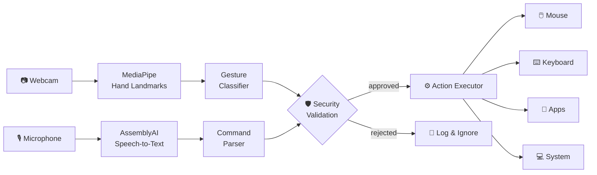
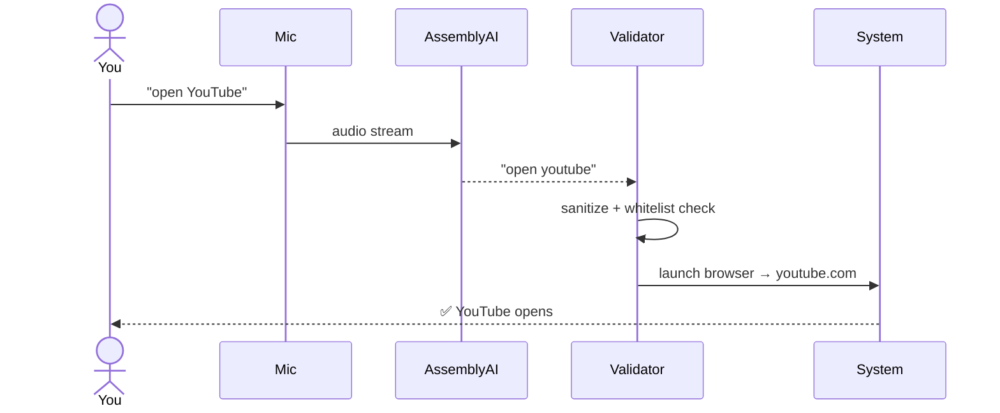

<div align="center">


# GestureVoice Control

**A touchless computer-control system powered by hand-gesture recognition and voice commands.**

[](https://github.com/Sayed-jibril/gesturevoice-control/releases)
[](https://www.python.org/)
[](LICENSE)
[](#-requirements)

[Quick Start](#-quick-start) · [Gestures](#-gesture-guide) · [Voice Commands](#-voice-commands) · [How It Works](#-how-it-works) · [Security](#-security) · [Contributing](#-contributing)

</div>

---

## 📌 Overview

**GestureVoice Control** lets you operate your computer without touching the mouse or keyboard. A webcam tracks your hand to move the cursor, click, scroll and zoom, while a microphone listens for spoken commands that open apps, browse the web, manage files and control the system.

|                        🖐️ See                        |                 🎤 Hear                 |                    ⚙️ Act                    |
| :--------------------------------------------------: | :-------------------------------------: | :------------------------------------------: |
| Tracks 21 hand landmarks in real time with MediaPipe | Converts speech to text with AssemblyAI | Validates every command, then runs it safely |

**Built for:** presentations · accessibility · hands-free coding · touchless kiosks · everyday convenience.

---

## ✨ Features

<table>
<tr>
<td width="33%" valign="top">

### 🖐️ Gesture Control

- Mouse movement
- Left and right click
- Scroll up / down
- Zoom
- Forward / backward navigation

</td>
<td width="33%" valign="top">

### 🎤 Voice Control

- **1,500+** voice commands
- Launch apps and websites
- File operations
- System controls
- Text and document editing

</td>
<td width="33%" valign="top">

### 🛡️ Safe by Design

- API keys kept in `.env`
- Command sanitization
- Whitelisted system actions
- Automatic app discovery
- Full activity logging

</td>
</tr>
</table>

---

## 🚀 Quick Start

> ⏱️ Takes about 5 minutes.

**1️⃣ Clone the repository**

```bash
git clone https://github.com/Sayed-jibril/gesturevoice-control.git
cd gesturevoice-control
```

**2️⃣ Install dependencies**

```bash
pip install -r requirements.txt
```

**3️⃣ Add your API key**

Get a free key from [AssemblyAI](https://www.assemblyai.com/), then:

```bash
# macOS / Linux
cp env.example .env

# Windows (Command Prompt)
copy env.example .env
```

Open `.env` and set:

```env
ASSEMBLYAI_API_KEY=your_api_key_here
```

**4️⃣ Run**

```bash
python HV_SYSTEM.py
```

✅ Your webcam turns on and the system starts listening. Raise your hand and try a gesture, or say a command.

📖 More help: [Setup Guide](SETUP.md) · [Usage Examples](USAGE.md) · [Configuration](CONFIG.md)

---

## 🖐️ Gesture Guide

Hold your hand in front of the camera, palm facing it, with good lighting.

| Gesture | Fingers raised             | Action                |
| :-----: | -------------------------- | --------------------- |
|   ☝️    | Index only                 | **Move the cursor**   |
|   ✌️    | Index + Middle             | **Left click**        |
|   🤟    | Index + Middle + Ring      | **Right click**       |
|   ✋    | All five fingers           | **Scroll up**         |
|   🖐️    | Four fingers, thumb folded | **Scroll down**       |
|   🤙    | Thumb + Index + Pinky      | **Zoom in**           |
|   🤞    | Pinky only                 | **Navigate forward**  |
|   👍    | Thumb only                 | **Navigate backward** |

> 💡 **Tip:** Keep your hand 40–80 cm from the camera and avoid strong backlight for best accuracy.

---

## 🎤 Voice Commands

Speak naturally. Commands are grouped into five categories:

| Category            | What you can do                           | Example phrases                    |
| ------------------- | ----------------------------------------- | ---------------------------------- |
| 🚀 **Applications** | Open Office apps, browsers, media players | "open Word", "open Chrome"         |
| 🌐 **Web**          | Jump to popular sites                     | "open YouTube", "open Gmail"       |
| 📁 **Files**        | Create, delete, rename                    | "create new folder", "rename file" |
| 💻 **System**       | Volume, windows, shutdown                 | "volume up", "minimize window"     |
| ✏️ **Text**         | Dictate and edit documents                | "select all", "copy", "paste"      |

> The full command list is in [USAGE.md](USAGE.md).

---

## 🧠 How It Works



**Typical flow when you say "open YouTube":**



---

## 🖥️ Requirements

| Component            | Requirement                                      |
| -------------------- | ------------------------------------------------ |
| **Operating system** | Windows 10/11 (primary) · macOS and Linux (beta) |
| **Python**           | 3.8 or newer                                     |
| **Memory**           | 4 GB minimum · 8 GB recommended                  |
| **Camera**           | Any built-in or USB webcam                       |
| **Microphone**       | Any audio input device                           |
| **Internet**         | Required for voice recognition                   |

---

## 🛡️ Security

Version 2.0 was redesigned with safety in mind:

| Protection                   | How it works                                              |
| ---------------------------- | --------------------------------------------------------- |
| 🔐 **No hardcoded secrets**  | API keys live in environment variables, never in code     |
| 🚫 **Injection protection**  | Every voice command is sanitized and validated before use |
| ✅ **Whitelisted execution** | Only approved system actions can run                      |
| 🔍 **Dynamic app discovery** | Installed apps are detected at runtime, so no fixed paths |
| 📝 **Audit logging**         | Every action is recorded for review                       |

> ⚠️ Never commit your `.env` file. It is already listed in `.gitignore`.

---

## 📈 Performance

Measured on a typical modern laptop:

| Metric                 | Result   |
| ---------------------- | -------- |
| Gesture latency        | < 100 ms |
| Gesture detection rate | 95%+     |
| CPU usage              | < 15%    |
| Memory usage           | ~200 MB  |

_Results vary with hardware, lighting and camera quality._

---

## 🔧 Troubleshooting

| Problem                    | Fix                                                               |
| -------------------------- | ----------------------------------------------------------------- |
| Camera not detected        | Close other apps using the webcam, then restart                   |
| Gestures are inaccurate    | Improve lighting and keep your whole hand in frame                |
| Voice commands not working | Check `ASSEMBLYAI_API_KEY` in `.env` and your internet connection |
| Cursor feels jittery       | Increase smoothing in [CONFIG.md](CONFIG.md)                      |

---

## 🤝 Contributing

Contributions are welcome! Please read the [Contributing Guidelines](CONTRIBUTING.md) first.

```bash
# 1. Fork the repo, then clone your fork
git clone https://github.com/<your-username>/gesturevoice-control.git
cd gesturevoice-control

# 2. Install development dependencies
pip install -r requirements-dev.txt

# 3. Create a branch, make changes, and run tests
git checkout -b feature/your-feature
python -m pytest tests/

# 4. Open a Pull Request
```

🐛 Found a bug or have an idea? [Open an issue](https://github.com/Sayed-jibril/gesturevoice-control/issues).

---

## 📄 License

Released under the [MIT License](LICENSE).

## 🙏 Acknowledgments

| Library                                        | Used for                      |
| ---------------------------------------------- | ----------------------------- |
| [MediaPipe](https://mediapipe.dev/)            | Hand landmark detection       |
| [AssemblyAI](https://www.assemblyai.com/)      | Speech recognition            |
| [OpenCV](https://opencv.org/)                  | Video capture and processing  |
| [PyAutoGUI](https://pyautogui.readthedocs.io/) | Mouse and keyboard automation |

## 👤 Author

**Mohammed Siad Jibril (Sayid)** · AI Engineer, Data Scientist & Full-Stack Developer

[](https://github.com/Sayed-jibril)

---

<div align="center">

**⭐ If this project helps you, please give it a star! ⭐**

</div>
